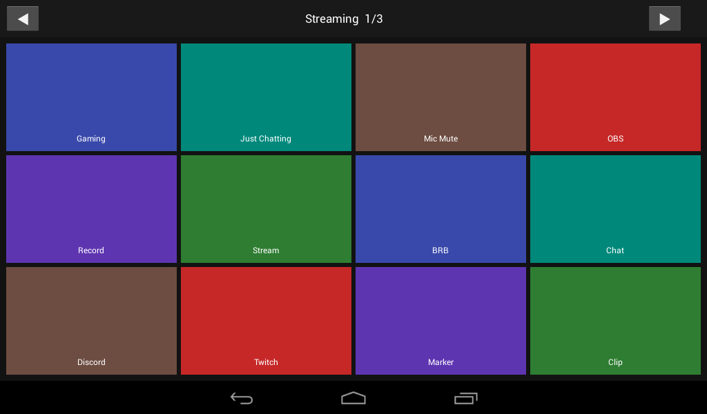
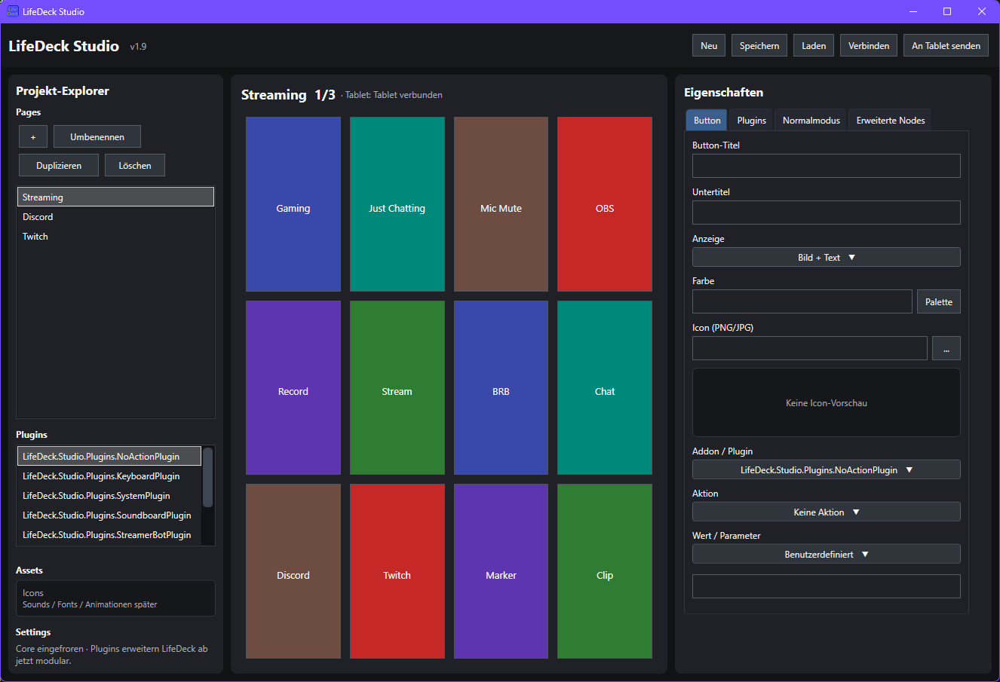
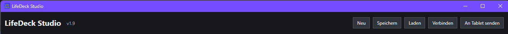
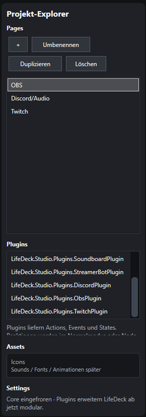
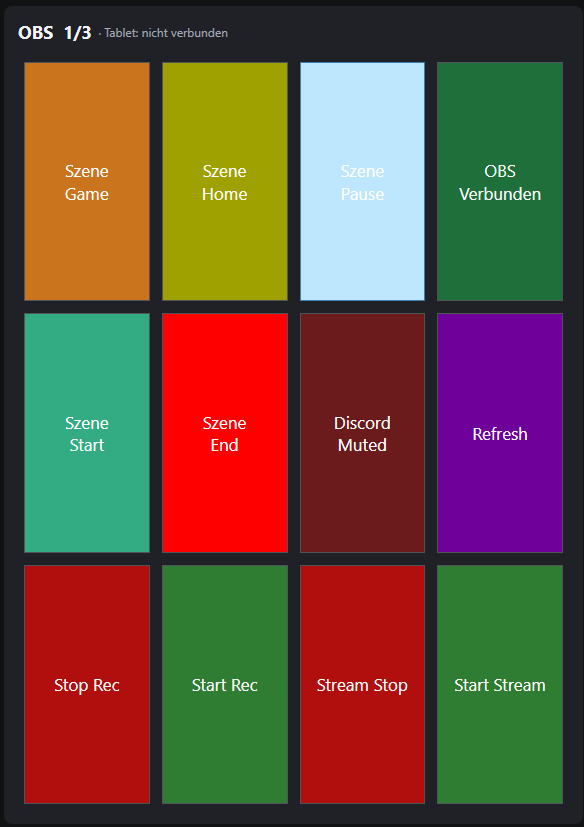
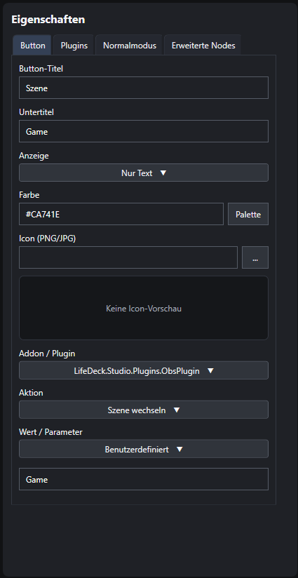
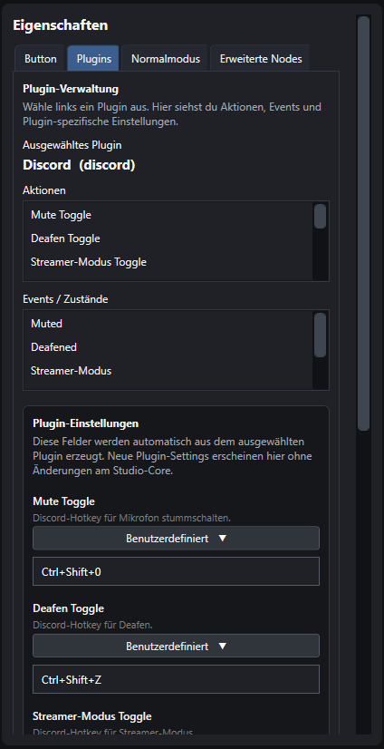
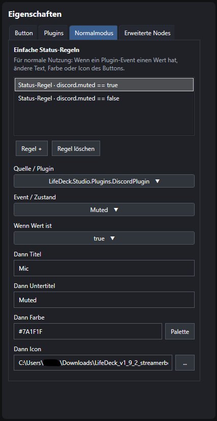

### LifeDeck v1.9

LifeDeck nutzt ein altes Android Tablet (In den Beispielen ein LifeTab E7312 mit Android 4.2.2) als Interface um eine Stream-Deck ähnliche Umgebung zu schaffen. Es hat bereits eine kleine Suite an Plugins (Hotkeys, Discord, OBS, System/PowerShell, Soundboard, Streamer.Bot und Twitch) welche umfangreiche Steuerung erlauben. Es läuft lokal und ist hoch anpassbar für zahlreiche unterschiedliche Anwendungsgebiete. Es kommt mit einem vorgefertigten Icon-Pack, aber es können auch eigene Icons verwendet werden (256x256 Pixel).

### Tablet:

Auf dem Tablet muss die App installiert werden (im Android Ordner namens LifeDeck.apk) und USB-Debugging über die Entwickleroptionen aktiviert sein. Außerdem muss das Tablet immer über USB mit dem Host PC verbunden sein. Die jetzige App ist für Android 4.2.2 optimiert, für modernere Android Versionen kann es sein das die App neu Compiled werden muss. Der ganze Sourcecode ist im Android Ordner enthalten. Außerdem kann man die Orientierung der App um 180° drehen wenn man für mindestens eine Sekunde auf oberen Navigationsbalken klickt. 

### PC:

Auf der PC Seite muss das LifeDeck Studio Programm gestartet werden (befindet sich in volgendem Pfad: LifeDeck.Studio --> bin --> Debug --> net8.0-windows --> LifeDeck.Studio.exe) welches die Hauptlogik und das Interface zur Bearbeitung aller Buttons, Plugins und Aktionen enthält. 

LifeDeck Studio ist in vier Hauptteile unterteilt. Die obere Hauptleiste zum Speichern und Laden der Sitzung, der Projekt-Explorer zum erstellen, löschen und umbenennen der unterschiedlichen Seiten und der Auswahl der zu bearbeitenden Plugins, eine Vorschau der Buttons und ein Eigenschaften Teil mit verschiedenen Tabs um die Buttons und Plugins zu bearbeiten.

### LifeDeck Studio:

###### Hauptleiste:

In der Hauptleiste kann man ein neues Projekt erstellen (dies überschreibt das letzte Projekt!), ein vorhandenes Projekt speichern und laden, das Tablet verbinden und für Debug Zwecke die jetzigen daten an das Tablet senden.

###### Projekt-Explorer:

Der Projekt-Explorer dient zum bearbeiten der unterschiedlichen Seiten und auswahl der zu bearbeitenden Plugins.

###### Vorschau:

Die Vorschau zeigt an welcher Butten gerade zum bearbeiten ausgewählt ist und wie er auf dem tablet nachher aussieht.

###### Eigenschaften:

In den Eigenschaften kann alles von den Buttons über die Plugins bis hin zu komplexeren Abläufen bearbeitet werden.

Buttons:

Im Buttons-Tab kann man einfache Grundeigenschaften der Buttons einstellen. man kann wählen ob man nur Text, nur Bild, oder Bild mit Text auf dem Button will. Außerdem kann man die Farbe ändern, ein Icon/Bild zuweisen (am besten 256x256 Pixel PNG oder JPG, unterstützt transparenten Hintergund) und ein Plugin auswählen. Plugins haben meist eigene Aktionen und Werte/Parameter, aber dazu mehr im folgenden Abschnitt. 

Plugins:

Im Plugins-Tab kann man einzelne Plugins Bearbeiten nachdem man sie im Explorer ausgewählt hat. Man kann sich die Aktionen und Events/Zustände des ausgewählten Plugins angucken und die Einstellungen des Plugins ändern. Bei einigen Plugins wie dem OBS, Twitch und Streamer.Bot Plugin muss man dort Zugangsdaten eingeben um eine verbindung zu etablieren. Dazu mehr in den Abschnitten zu der Einrichtungen der einelnen Plugins.

Normalmodus:

Der Normalmodus ist eine vereinfachtere Art des "Erweiterte Nodes" Modus und dient zum ändern der Titel und Untertitel, Farbe und der Icons abhängig von Events und deren Zuständen. Man kann eine neue Regel hinzufügen welche abhängig von dem zustand eines gewählten Events des plugins das Aussehen des Buttons ändert. Der Wert ist meist true oder false. Dieser Modus kann nur verwendet werden wenn das ausgewählte Plugin Events/Zusände integriert hat. 

Erweiterte Nodes:

Die Erweiterten Nodes sind eine Komplexere Form des Normalen Modus und eher für Leute die Programmierkenntnisse haben geeignet. Sie ist stand v1.9 noch nicht voll ausgebaut und wird deswegen auch nicht weiter erläutert. 

###### Streamer.Bot Plugin:

Um das Streamer.Bot Plugin zu verbinden muss im Streamer.Bot unter Server/Clients der WebSocket Server Autostart aktiviert sein und Authentication aktiviert sein. Dann muss im LifeDeck Studio das Plugin im Explorer ausgewählt sein und im Plugins Tab der Eigenschaften die Daten übertragen werden. Host, Port und Endpoint müssen meist nicht bearbeitet werden. Nur das Erstellte Passwort muss übertragen werden. Jetzt kann man im Streamer.Bot den Server starten und in LifeDeck Studio einen Button einrichten der die "Verbinden" Aktion des Streamer.Bot Plugins ausführt. Sobald der Button gedrückt wurde sollte in der Liste "Connected Clients" im Streamer.Bot eine zeile mit der Adresse (meist 127.0.0.1) auftauchen. Jetzt ist das Plugin verbunden und kann genutzt werden. Der hauptnutzen ist um Aktionen auszuführen.

###### Discord Plugin:

Das Discord Plugin ist wegen fehlender und unnötig komplizierter API Gestaltung nur halb implementiert und nutzt Hotkeys. Diese muss man in Discord manuell einrichten und dann in LifeDeck Studio übertragen. Manuell erstellte Hotkeys funktionieren immer, aber interne Hotkeys die von Discord vorgefertigt sind wie Anruf annehmen und Zum aktuellen Anruf funktionieren nur wenn Discord im Vordergrund ist.

###### OBS Plugin:

Um das OBS Plugin zu verbinden muss die WebSocket-Servereinstellungen in OBS im "Werkzeuge" Tab offnen. "WebSocket-Server aktivieren" muss ein Haken gesetzt werden. Bei "Verbindungsinformationen anzeigen" sieht man die Server-IP und das Serverpasswort welche in die Plugin Einstellungen in LifeDeck Studio eigetragen werden müssen. In den meisten Fällen muss nur die Host-IP und das Passwort übertragen werden. Auch hier muss wieder ein Button zum verbinden eingerichtet werden und wenn dieser gedrückt wurde sollte sich der Untertitel zu "Verbunden" ändern. Anschließend kann man mit dem Plugin alles mögliche in OBS steuern, von Szenen über Elemente bis hin zu Audioeinstellungen.

###### Twitch Plugin:

Das Twitch Plugin ist etwas komplizierter einzurichten. Man muss unter https://dev.twitch.tv/console/apps eine neue Anwendung registrieren außerdem muss Zwei-Faktor Authentifizierung für das Twitch Konto aktiviert sein. Man wählt einen beliebigen Namen und gibt bei "OAuth Redirect URLs" "http://localhost:3000" ein und bei "Kategorie" "other" und klickt auf Erstellen. Jetzt muss man bei der neuen Anwendung auf Verwalten klicken und die Client-ID kopieren. Diese muss in LifeDeck Studio in den Plugin Einstellungen eigetragen werden. Der Rest wird ach dem Verbinden automatisch erkannt und eingetragen. Jetzt muss wieder ein Button für das Login erstellt werden und betätigt werden. Daraufhin wird man auf eine Autorisierungswebsite von Twitch im Browser weitergeleitet und muss die Atorisierung bestätigen. Jetzt muss man nur noch einen Butten erstellen um den Login abzuschließen. Sobald sie der Untertitel dieses Buttons auf "Twitch" ändert ist die Verbindung vollendet. Jetzt kann alles von Chat Modi bis hin zu Kategorien und Markern alles gesteuert werden. 

###### Keyboard und System Plugin:

Mit diesen beiden Plugins kann man Hotkeys betätigen und Texte automatisch schreiben (Keyboard Plugin) und Dateien und Programme ausführen, Ordner öffenen und PowerShell-Skripte ausführen (System plugin).

Ich arbeite außerdem weiter an diesem Projekt und freue mich über Feedback und Vorschläge. Es sind noch ein paar weitere Plugins geplant und generelle verfeinerung der GUI.
